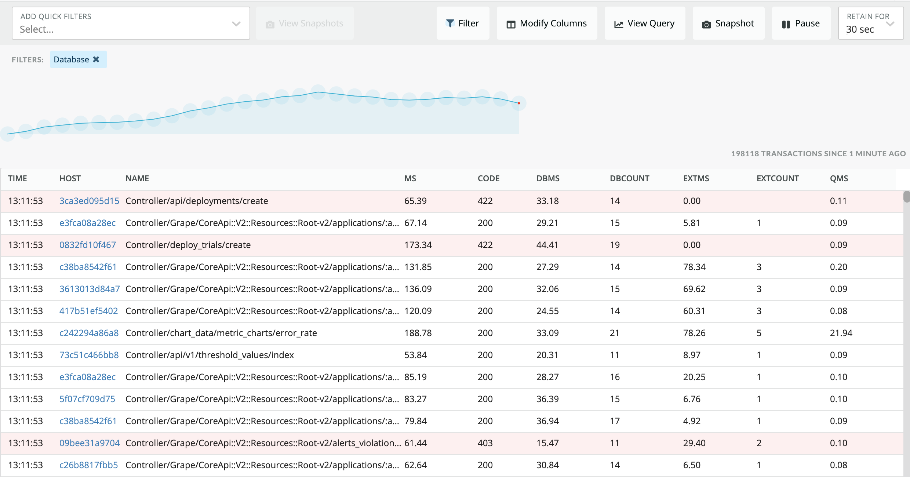

# Event Stream

View and filter transactional events live.
Supports: APM (Transaction, TransactionError)

Author: Kav Pather



## Open Source License

This project is distributed under the [Apache 2 license](LICENSE).

## Getting started

Run the following scripts:

```
npm install
npm start
```

Visit https://one.newrelic.com/?nerdpacks=local, navigate to an application and click Event Stream, and :sparkles:

# Deploying this Nerdpack

Open a command prompt in the nerdpack's directory and run the following commands.

```bash
# this is to create a new uuid for the nerdpack so that you can deploy it to your account
nr1 nerdpack:uuid -g [--profile=your_profile_name]
# to see a list of APIkeys / profiles available in your development environment, run nr1 credentials:list
nr1 nerdpack:publish [--profile=your_profile_name]
nr1 nerdpack:deploy [-c [DEV|BETA|STABLE]] [--profile=your_profile_name]
nr1 nerdpack:subscribe [-c [DEV|BETA|STABLE]] [--profile=your_profile_name]
```

Visit https://one.newrelic.com, navigate to the Nerdpack, and :sparkles:

# Support

New Relic has open-sourced this project. This project is provided AS-IS WITHOUT WARRANTY OR SUPPORT, although you can report issues and contribute to the project here on GitHub.

_Please do not report issues with this software to New Relic Global Technical Support._

## Community

New Relic hosts and moderates an online forum where customers can interact with New Relic employees as well as other customers to get help and share best practices. Like all official New Relic open source projects, there's a related Community topic in the New Relic Explorer's Hub. You can find this project's topic/threads here:

https://discuss.newrelic.com/c/build-on-new-relic/nr1-event-stream
*(Note: URL subject to change before GA)*

## Issues / Enhancement Requests

Issues and enhancement requests can be submitted in the [Issues tab of this repository](https://github.com/newrelic/nr1-event-stream/issues). Please search for and review the existing open issues before submitting a new issue.

# Contributing

Contributions are welcome (and if you submit a Enhancement Request, expect to be invited to contribute it yourself :grin:). Please review our [Contributors Guide](CONTRIBUTING.md).

Keep in mind that when you submit your pull request, you'll need to sign the CLA via the click-through using CLA-Assistant. If you'd like to execute our corporate CLA, or if you have any questions, please drop us an email at opensource@newrelic.com.